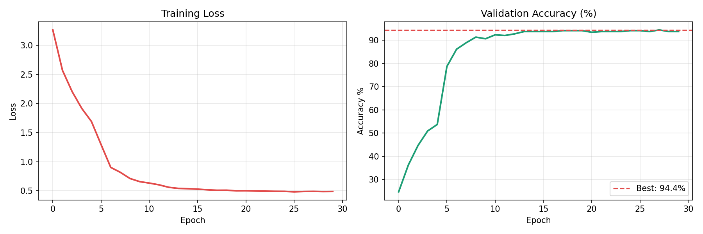
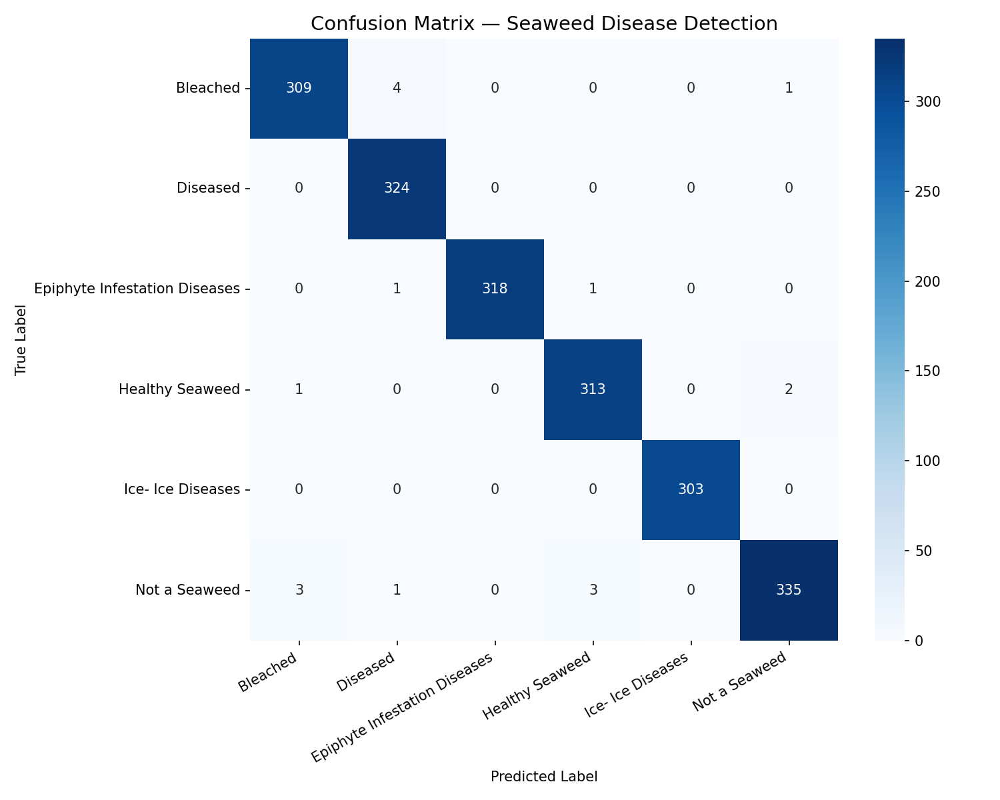

<div align="center">

# Seaweed Disease Detection System
### Prototype Mobile-Ready Application for Seaweed Disease Detection Using Deep Learning

[](https://seaweed-diseases-api.vercel.app)
[](https://seaweed-diseases-api.vercel.app)
[](https://python.org)
[](https://pytorch.org)
[](LICENSE)

**A proof-of-concept prototype demonstrating the feasibility of deep learning for automated seaweed disease classification to support aquaculture health monitoring. Built with EfficientNet-B2, FastAPI, and React.**

[Live Demo](https://seaweed-diseases-api.vercel.app) • [API Docs](https://saber131-seaweed-disease-v2.hf.space/docs) • [HuggingFace](https://huggingface.co/spaces/Saber131/seaweed-disease-v2)

</div>

---

## Overview

Seaweed farming is a critical component of global aquaculture, yet disease outbreaks remain a major threat to production yield and farmer livelihoods. Early and accurate disease identification is essential for effective disease management.

This project presents a proof-of-concept mobile-ready deep learning system capable of identifying six seaweed health conditions from a single image, deployed as a publicly accessible web application. The system is designed to be accessible to farmers, researchers, and aquaculture professionals worldwide.

---

## Key Features

- 94.4% validation accuracy across 6 disease classes
- Mobile-ready — works on any device with a browser
- 50 languages supported including right-to-left languages (Arabic, Hebrew, Persian)
- Real-time prediction with confidence score
- Low-confidence warning system for uncertain predictions
- Rejection class for non-seaweed inputs
- Publicly deployed and accessible to anyone worldwide

---

## Live Demo

[https://seaweed-diseases-api.vercel.app](https://seaweed-diseases-api.vercel.app)

Upload any seaweed image and get an instant disease prediction with confidence score.

---

## Results

### Training Performance

| Metric | Value |
|---|---|
| Best Validation Accuracy | 94.4% |
| Best Epoch | 28 / 30 |
| Final Training Accuracy | 99.4% |
| Validation Loss | 0.49 |
| Total Training Time | ~40 minutes (Tesla T4 GPU) |

### Training Curves



### Confusion Matrix



---

## System Architecture

```
User (Mobile/Desktop)
        |
        v
React Frontend (Vercel)
        |
        v
FastAPI Backend (HuggingFace Spaces)
        |
        v
EfficientNet-B2 Model
        |
        v
Disease Classification Result
```

---

## Disease Classes

| Class | Description |
|---|---|
| Healthy Seaweed | Normal, disease-free seaweed |
| Ice-Ice Diseases | Caused by environmental stress and bacterial infection |
| Bleached | Loss of pigmentation due to stress or disease |
| Epiphyte Infestation Diseases | Overgrowth of epiphytic organisms |
| Diseased | Includes white rot, red rot, and microbial infections |
| Not a Seaweed | Rejects non-seaweed inputs |

---

## Model

| Property | Details |
|---|---|
| Architecture | EfficientNet-B2 |
| Pretrained On | ImageNet |
| Input Size | 288 x 288 px |
| Parameters | ~9.7M |
| Training Epochs | 30 |
| Best Validation Accuracy | 94.4% |
| Framework | PyTorch + TIMM |

### Training Strategy

- Phase 1 (Epochs 1-5): Backbone frozen, only classifier head trained
- Phase 2 (Epochs 6-30): Full network fine-tuned end-to-end
- Optimizer: AdamW with cosine annealing scheduler
- Loss: Cross-entropy with label smoothing (0.1)

---

## Project Structure

```
seaweed-disease-detection/
├── api/
│   ├── main.py              # FastAPI inference server
│   ├── Dockerfile           # Docker configuration
│   ├── requirements.txt     # Python dependencies
│   └── classes.json         # Class labels
├── frontend/
│   ├── App.jsx              # React frontend
│   ├── main.jsx             # Entry point
│   └── index.css            # Styles
├── assets/
│   ├── confusion_matrix.png # Evaluation results
│   └── training_curves.png  # Training progress
└── README.md
```

---

## How to Run

### Backend API

```bash
cd api
pip install -r requirements.txt
uvicorn main:app --reload --port 8000
```

API available at `http://localhost:8000`
Interactive docs at `http://localhost:8000/docs`

### Frontend

```bash
cd frontend
npm install
npm run dev
```

Frontend available at `http://localhost:5173`

---

## Dataset

- Source: Literature review — screenshots from published research papers
- Total Images: 1,919
- Classes: 6
- Images per class: 300-350
- Split: 85% training (1,632) / 15% validation (287)

---

## Limitations and Future Work

- Dataset was collected from research paper screenshots due to the absence of a public benchmark dataset for seaweed diseases. Real-world performance on field photographs may differ.
- Approximately 5-10% of images contained figure annotations such as scale bars and labels, mitigated through aggressive random cropping augmentation during training.
- The Diseased class is a compound category combining white rot, red rot, and microbial infections due to limited individual sample counts.
- Future work includes collecting real field photographs, expanding dataset size, implementing Grad-CAM visualization, and conducting clinical validation with domain experts.

---

## Tech Stack

| Layer | Technology |
|---|---|
| Deep Learning | PyTorch, TIMM, EfficientNet-B2 |
| Backend API | FastAPI, Uvicorn |
| Frontend | React, Vite |
| Deployment | HuggingFace Spaces (API), Vercel (Frontend) |
| Containerization | Docker |
| Training Environment | Google Colab (Tesla T4 GPU) |

---

## Author

**Md Saber Hossain**

- GitHub: [mdsaberhossain](https://github.com/mdsaberhossain)
- HuggingFace: [Saber131](https://huggingface.co/Saber131)
- Live Demo: [seaweed-diseases-api.vercel.app](https://seaweed-diseases-api.vercel.app)

---

## License

This project is licensed under the MIT License.

---

*Developed for Aquaculture Health Monitoring Research*